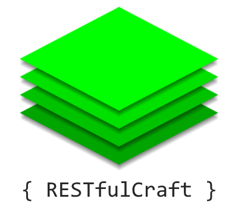

Introducing software development concepts to Minecraft by turning worlds into a RESTful web service that allows players to create, view, update, and destroy blocks with code or tools such as Postman or cURL.

## Configuration
There are two configuration settings for RESTfulCraft.
- `authKey` is the only acceptable value of the `Authorization` header when you connect. It is blank by default.
- `port` is the server API port. By default, it is `56552`.

## Tutorial
### Prerequisites
- This tutorial will be utilizing [cURL](https://curl.haxx.se/windows/), a program used for debugging web services.
    - Once cURL installed, open Command Prompt and type `curl` to verify it works.
- Install RESTfulCraft, open Minecraft, and create a new superflat world.
- Teleport to x=0, y=4, z=0 to simplify this tutorial.

### Getting a block
Try the following command in Command Prompt:
- `curl -X GET http://localhost:56552/api/v1/minecraft/overworld/0/4/0`

If there was no error, the following should appear.

```json
{
  "id": "minecraft:air",
  "properties": {
    
  },
  "tileEntity": null,
  "entities": [
    {
      ... this big blob here is you, actually...
    }
  ]
}
```

Congrats! You've queried your first block using RESTfulCraft.

#### Review
- `-X GET` in the command tells cURL to _get_ something from RESTfulCraft, in this case, a block.
- The last 3 numbers in the URL are your coordinates, `/x/y/z`.
    - Try different coordinates to get different results!
- `id` in the JSON response is the block ID, in this case `minecraft:air`.
- `entities` contains the entities standing inside of the block being queried.

### Placing a block
First, move out of the way because we'll be making a block right where you stand.
- `curl -d '{"id":"minecraft:bedrock"}' -H "Content-Type: application/json" -X POST http://localhost:56552/api/v1/minecraft/overworld/0/4/0`

Once again, assuming no error, the following response will be emitted:

```json
{
  "placed": true
}
```

If you look where you were originally standing, you'll find you've placed a bedrock block. Well done!

#### Review
- `-X POST` tells cURL to _post_ something to RESTfulCraft, in this case, RESTfulCraft places a block.
    - Retry the command and you will get an error. Interesting.
- `-d '...'` is a message body, it is JSON telling RESTfulCraft what to place.
    - Like in the last tutorial, `id` is a block ID, in this case `minecraft:bedrock`.
    - Break the bedrock and retry with a different block ID.

### Replacing a block
Notice in the explanation how retrying the same command twice causes an error. This is because `POST` requests are conventionally designed to be done once to create new records and fill empty ones.

What we want is to _replace_ a block, which is what `PUT` is for.

Try:
- `curl -d '{"id":"minecraft:furnace"}' -H "Content-Type: application/json" -X PUT http://localhost:56552/api/v1/minecraft/overworld/0/4/0`

Like before, expect:

```json
{
  "replaced": true
}
```

You've replaced the bedrock block with a furnace.

#### Review
- Start up the furnace and run a `GET` request on it, the `tileEntity` tag in the JSON will be populated with information instead of `null` like it was the first time we tried it on `minecraft:air`.
- You've learned how to delete blocks by doing a `PUT` request with `minecraft:air`.

### Updating a block
You've got your furnace running, but _what if it is too bright for you?_ You could do something like:
- `curl -d '{"id":"minecraft:furnace","properties":{"lit":false}}' -H "Content-Type: application/json" -X PUT http://localhost:56552/api/v1/minecraft/overworld/0/4/0`

Right click your furnace, **it's still burning!**
Let's do use a `PATCH` request to undo that. Try:
- `curl -d '{"lit":true}' -H "Content-Type: application/json" -X PATCH http://localhost:56552/api/v1/minecraft/overworld/0/4/0`

Notice how much shorter this command is, that's because it doesn't affect the block, just the state's properties. It's something called a _shorthand_, think of it like a shortcut for your hands when you type.

No review necessary here, at this point we're admiring the simplicity of REST by softly changing request parameters.

### Deleting a block
Okay, let's wrap up this tutorial. We learned earlier that `PUT` requests allow you to "erase" blocks, but `DELETE` requests exist as a way to gracefully destroy blocks (still dangerous, will point it out below).

Give this command a try:
- `curl -X DELETE http://localhost:56552/api/v1/minecraft/overworld/0/4/0`

The furnace broke and dropped itself, however, it's inventory was erased (this is what I was pointing out.)

## Conclusion

That's it! That's the tutorial. If any interest persists, I'll be open to making a video or another written tutorial going through some of the more fun and advanced stuff you could do with this, but for now, I want to see what _you_ can come up with.